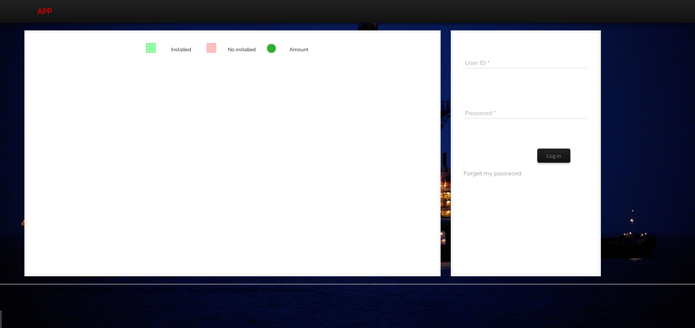

APP System
========================

This is an application developed for an international oil company launched on September 2014, it is based on Symfony 2 and jQuery.

As it is a product for a particular customer note that all information and trademarks has been removed and the applicaction simply called APP System, so feel free to change the name.

This app has been created to manage equipments and staff, their current positions in differents projects. Within the actions, you can install and uninstall an equipments set in a location, aslo set staff and rotate them.

Instructions
============
**1) Clone this project**

You can clone this project just copying the url using

    git clone https://github.com/mherrera05/equipments-app.git <folder-name>

----------------------------------
**2) Use composer to install vendors (recommended)**

As this project has a composer.json and composer.lock file, you can install vendors running the following command

    composer install

------------------------------------
**3) Create schema in database**

To create schema go to project folder and run the following command

    php app/cache doctrine:schema:create

------------------------------------
**4) Once vendors installation finish and schema has been created**

Just miss to give permission to certain folders

    app/cache
    app/logs

-----------------------------------
**4) Access via http**

If all were OK, you will get the login page

-----------------------------------
**5) First user**

Sadly this app does not have fixtures to load and not even signup page, so to enter you have to create the first user directly on database.

-----------------------------------

What's inside?
---------------

Also Symfony composition, this project is separated in various bundles:

  * **Rto/CoreBundle** - The core application to manage layouts, menus, login, etc.

  * **Rto/AdminBundle** - This contain all logic to create the data that will go to use the app. Create a project, locations, brands and type of equipments, etc.

  * **Rto/EquipmentsBundle** - Dedicated exclusively to equipments management.

  * **Rto/OperationsBundle** - Dedicated exclusively to staff management.

  * **Rto/ProfileBundle** - This allow the user manage its account.

  * **Rto/ReportsBundle** - This bundle generate some reports used on the app.

  * **Rto/UsersBundle** - This bundle allow to manage the application users.

Warning
===============================

This project can contains some actions considered as bad practices, despite is a functional application and works.

Enjoy!
